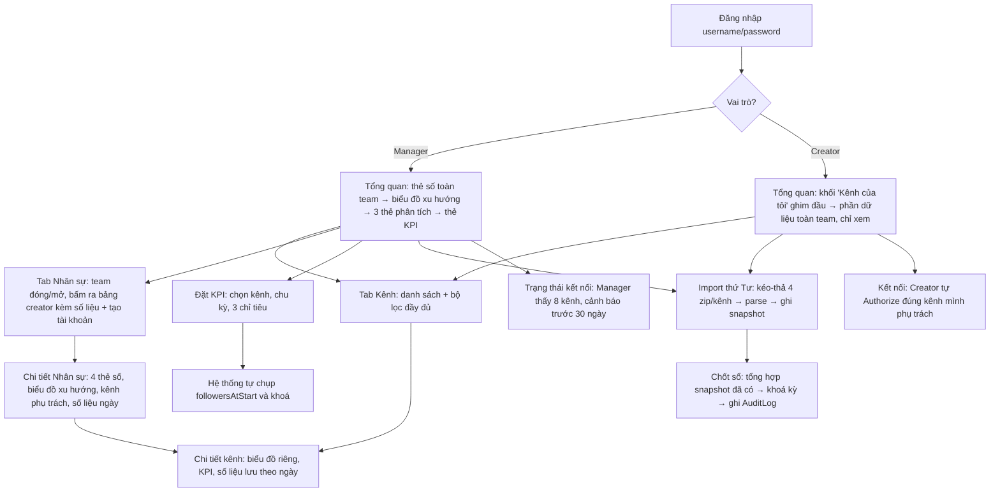

# User Flow

## Trang Tổng quan — một route, rẽ nhánh theo vai trò

`/` dùng chung một component. Vai trò quyết định phần đầu trang và các nút hiển thị.

## Hai luồng vận hành định kỳ

| Việc | Ai | Khi nào | Màn hình |
| :--- | :--- | :--- | :--- |
| Đồng bộ Display API | Cron tự động | Hằng ngày ~03:00 giờ VN | — (kết quả hiện ở Tổng quan, nhãn *tạm tính*) |
| Import file Studio | **Manager hoặc Creator** — Creator chỉ kênh mình phụ trách (21/08/2026, theo vận hành thực tế) | **Thứ Tư**, cho tuần trước đó | Màn import |
| Chốt sổ chu kỳ | Manager | Sau khi import phủ hết chu kỳ | Màn chốt sổ |
| OAuth (kết nối/kết nối lại) | **Manager hoặc Creator** — Creator chỉ kênh mình phụ trách | Lần đầu, hoặc khi token sắp hết hạn (cảnh báo trước 30 ngày) | Màn kết nối |

## Khác biệt theo vai trò

| | Manager | Creator |
| :--- | :--- | :--- |
| Đầu trang Tổng quan | Thẻ số tổng hợp toàn team | Khối "Kênh của tôi" + gợi ý hành động |
| Phần dữ liệu toàn team | Đầy đủ | Đầy đủ, gắn nhãn "Chỉ xem"; kênh của mình được tô đậm |
| Tab điều hướng | Tổng quan · Kênh · Creator · Dữ liệu (Import + Nhập tay + Kết nối) · KPI | Tổng quan · Kênh · Dữ liệu (Import + Kết nối, không có Nhập tay) · KPI của tôi |
| Nút Đặt KPI / Chốt sổ / Xuất dữ liệu | Có | Ẩn |
| Import file Studio | Toàn bộ 8 kênh | Chỉ kênh mình đang phụ trách |
| Kết nối Display API | Toàn bộ 8 kênh + nút "Chạy đồng bộ ngay" | Chỉ kênh mình đang phụ trách, không có nút đồng bộ toàn hệ thống |
| Tạo tài khoản Creator | Có | Ẩn |

## Ghi chú

- Creator xem được số liệu kênh khác (yêu cầu minh bạch để học hỏi chéo), nhưng không sửa được gì.
- Không có self-signup. Manager tạo tài khoản Creator.
- Chốt sổ chỉ Manager thực hiện.
- **Kết nối Display API là ngoại lệ**: Creator được tự Authorize kênh mình phụ trách (quyết định M3b,
  20/08/2026) — Creator có sẵn tài khoản TikTok của chính kênh, Manager thì không, nên bắt Manager làm
  hộ cả 8 kênh không thực tế. Vẫn phải thêm tài khoản đó vào Sandbox Target Users trên TikTok developer
  portal trước — việc chỉ người có quyền truy cập portal (hiện là Manager) làm được, không tránh được
  dù ai bấm "Kết nối" trong app.
- **Nhân sự có 2 tầng, thêm 21/08/2026**: `/creators` liệt kê team dạng accordion (đóng mặc định, hiện
  sẵn số liệu rollup) — bấm mở ra bảng từng creator, bấm tên creator vào `/creators/[id]` (4 thẻ số,
  biểu đồ, bảng kênh phụ trách bấm được sang `/channels/[id]`, số liệu theo ngày gộp mọi kênh). Route
  `/creators/team/[id]` cũ đã bỏ — gộp hết vào panel accordion.
- **Import file Studio cũng là ngoại lệ, thêm 21/08/2026**: bản đặc tả gốc chỉ cho Manager, nhưng vận
  hành thực tế đã có Creator tự export & upload file Studio hàng tuần cho kênh mình phụ trách — sửa
  lại cho khớp thực tế thay vì bắt đổi quy trình vận hành. **Khác với `manual_entry`**: import Studio
  là nộp file máy TikTok sinh ra, không tự khai số, nên không phạm nguyên tắc "người hưởng thưởng
  không tự khai số tính thưởng" — `manual_entry` (tự gõ số tay) **vẫn chỉ Manager**, không đổi.
  Enforcement thật ở RLS (`20260821000004_creator_studio_import.sql`), không chỉ ở check màn hình.
