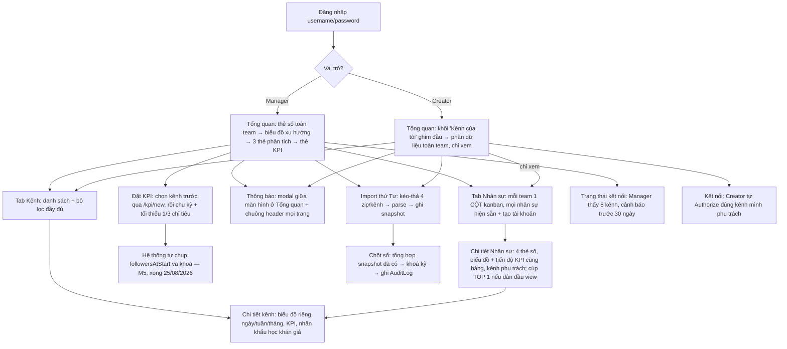

# User Flow

## Trang Tổng quan — một route, rẽ nhánh theo vai trò

`/` dùng chung một component. Vai trò quyết định phần đầu trang và các nút hiển thị.

## Hai luồng vận hành định kỳ

| Việc | Ai | Khi nào | Màn hình |
| :--- | :--- | :--- | :--- |
| Đồng bộ Display API | Cron tự động | Hằng ngày ~23:30 giờ VN | — (kết quả hiện ở Tổng quan, nhãn *tạm tính*) |
| Import file Studio | **Manager hoặc Creator** — Creator chỉ kênh mình phụ trách (21/08/2026, theo vận hành thực tế) | **Thứ Tư**, cho tuần trước đó | Màn import |
| Chốt sổ chu kỳ | Manager | Sau khi import phủ hết chu kỳ | Màn chốt sổ |
| OAuth (kết nối/kết nối lại) | **Manager hoặc Creator** — Creator chỉ kênh mình phụ trách | Lần đầu, hoặc khi token sắp hết hạn (cảnh báo trước 30 ngày) | Màn kết nối |

## Khác biệt theo vai trò

| | Manager | Creator |
| :--- | :--- | :--- |
| Đầu trang Tổng quan | Thẻ số tổng hợp toàn team | Khối "Kênh của tôi" + gợi ý hành động |
| Phần dữ liệu toàn team | Đầy đủ | Đầy đủ, gắn nhãn "Chỉ xem"; kênh của mình được tô đậm |
| Tab điều hướng | Tổng quan · Kênh · Nhân sự · Dữ liệu (Import + Nhập tay + Kết nối) · KPI | Tổng quan · Kênh · Nhân sự · Dữ liệu (Import + Kết nối, không có Nhập tay) · KPI của tôi |
| Trang Nhân sự (`/creators`, `/creators/[id]`) | Đầy đủ | Đầy đủ, gắn nhãn "Chỉ xem" (09/09/2026) — ẩn "+ Tạo tài khoản", quản lý Team, nút "Sửa" mỗi thẻ, "Sửa thông tin", "+ Đặt KPI" |
| Nút Đặt KPI / Chốt sổ / Xuất dữ liệu | Có | Ẩn |
| Import file Studio | Toàn bộ 8 kênh | Chỉ kênh mình đang phụ trách |
| Kết nối Display API | Toàn bộ 8 kênh + nút "Chạy đồng bộ ngay" | Chỉ kênh mình đang phụ trách, không có nút đồng bộ toàn hệ thống |
| Tạo tài khoản Creator | Có | Ẩn |

## Ghi chú

- Creator xem được số liệu kênh khác (yêu cầu minh bạch để học hỏi chéo), nhưng không sửa được gì.
  Từ 09/09/2026 gồm cả **trang Nhân sự** (`/creators` + `/creators/[id]`) ở chế độ chỉ-xem — thấy
  danh sách mọi Creator, phân team, kênh phụ trách, huy chương xếp hạng theo view, và tiến độ KPI
  (chu kỳ đang chạy) của từng kênh. Mọi thao tác tạo/sửa/xoá + quản lý Team vẫn Manager-only, gate
  theo `user.role` ở page + `requireManager()` ở mọi server action/route đằng sau.
- Không có self-signup. Manager tạo tài khoản Creator.
- Chốt sổ chỉ Manager thực hiện.
- **Kết nối Display API là ngoại lệ**: Creator được tự Authorize kênh mình phụ trách (quyết định M3b,
  20/08/2026) — Creator có sẵn tài khoản TikTok của chính kênh, Manager thì không, nên bắt Manager làm
  hộ cả 8 kênh không thực tế. Vẫn phải thêm tài khoản đó vào Sandbox Target Users trên TikTok developer
  portal trước — việc chỉ người có quyền truy cập portal (hiện là Manager) làm được, không tránh được
  dù ai bấm "Kết nối" trong app.
- **Nhân sự có 2 tầng, thêm 21/08/2026**: `/creators` — mỗi team một CỘT kanban (`TeamBoard`, đổi từ
  accordion 08/09/2026 theo yêu cầu "vào trang là xem hết nhân sự luôn"), cuộn ngang khi nhiều team,
  "Chưa gán team" là một cột. Mỗi creator là một thẻ gọn (avatar + tên + 3 số + badge + nút Sửa mở
  Modal); bấm tên vào `/creators/[id]` (4 thẻ số, biểu đồ xu hướng, **thẻ "Tiến độ KPI các kênh"**
  — mỗi kênh 1 dòng badge 🟢🟡🔴 + "cần X/ngày", bấm sang `/channels/[id]`, và bảng kênh phụ trách).
  Bảng "Số liệu đã lưu theo ngày" **đã bỏ khỏi cả `/creators/[id]` và `/channels/[id]`** (08/09/2026,
  theo yêu cầu — biểu đồ mốc "ngày" thay). `?team=<id>` (pill team ở trang chi tiết Creator) cuộn cột
  đó vào tầm nhìn. Route `/creators/team/[id]` cũ đã bỏ.
  **Từ 09/09/2026 cả hai trang mở cho Creator (chỉ-xem)** — `page.tsx` không còn `redirect("/")`, thay
  bằng `const isManager = user.role === "manager"`; `TeamBoard` nhận prop `canManage`, `CreatorKpiCard`
  nhận `canManage`. Nhãn "Chỉ xem" cạnh H1 / cạnh tên khi `!isManager`.
  **`/creators/[id]` của người dẫn đầu lượt xem toàn team** (09/09/2026): avatar cúp vàng + huy hiệu
  "🏆 TOP 1 lượt xem toàn team" cạnh tên — xếp hạng toàn thời gian, cùng nghĩa với 🥇 ở `/creators` và
  thông báo `leader_flex` (`lib/dashboard.ts` `rankCreatorsAllTime`). Biểu đồ "Diễn biến" + thẻ "Tiến
  độ KPI các kênh" nằm chung một hàng cho dễ đọc.
- **Cơ chế thông báo (08–09/09/2026)** — hiện ở mọi vai trò: **modal giữa màn hình** ở Tổng quan
  ("bắt buộc phải xem", chỉ nút "Đã xem") + **chuông** ở header mọi trang (badge chưa đọc + danh sách
  gần đây). Thông báo thứ hạng (`leader_flex`, `runner_up`) + `import_missing` hiện lại mỗi lần vào
  Tổng quan; loại khác (`import_reminder`, `kpi_assigned`, `kpi_achieved`) hiện một lần. **Về import
  thứ Tư:** Creator thấy `import_reminder` ("hãy nhập dữ liệu"); Manager KHÔNG (Manager không nộp
  data) — thay bằng `import_missing` nêu đích danh ai chưa nộp file tuần trước, lặp tới thứ CN /
  tới khi mọi người đã nộp. Giọng Manager lịch sự, giọng Creator vui. Nhật ký `localStorage` (chưa
  có bảng DB). Chi tiết: [PROGRESS.md](PROGRESS.md) mục "Cơ chế thông báo".
- **Import file Studio cũng là ngoại lệ, thêm 21/08/2026**: bản đặc tả gốc chỉ cho Manager, nhưng vận
  hành thực tế đã có Creator tự export & upload file Studio hàng tuần cho kênh mình phụ trách — sửa
  lại cho khớp thực tế thay vì bắt đổi quy trình vận hành. **Khác với `manual_entry`**: import Studio
  là nộp file máy TikTok sinh ra, không tự khai số, nên không phạm nguyên tắc "người hưởng thưởng
  không tự khai số tính thưởng" — `manual_entry` (tự gõ số tay) **vẫn chỉ Manager**, không đổi.
  Enforcement thật ở RLS (`20260821000004_creator_studio_import.sql`), không chỉ ở check màn hình.
